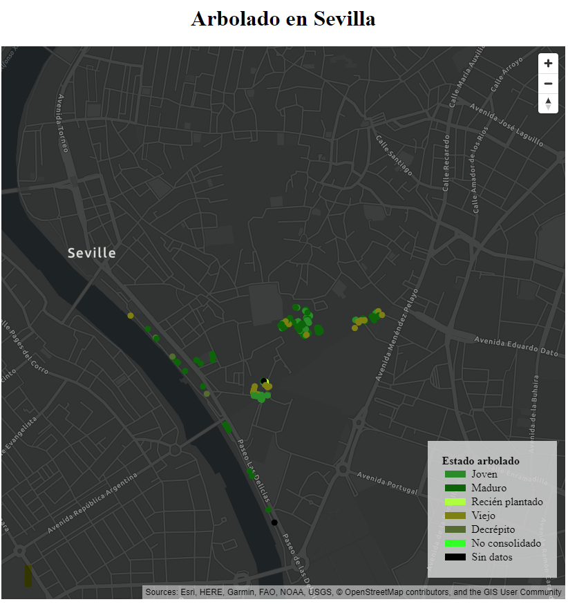
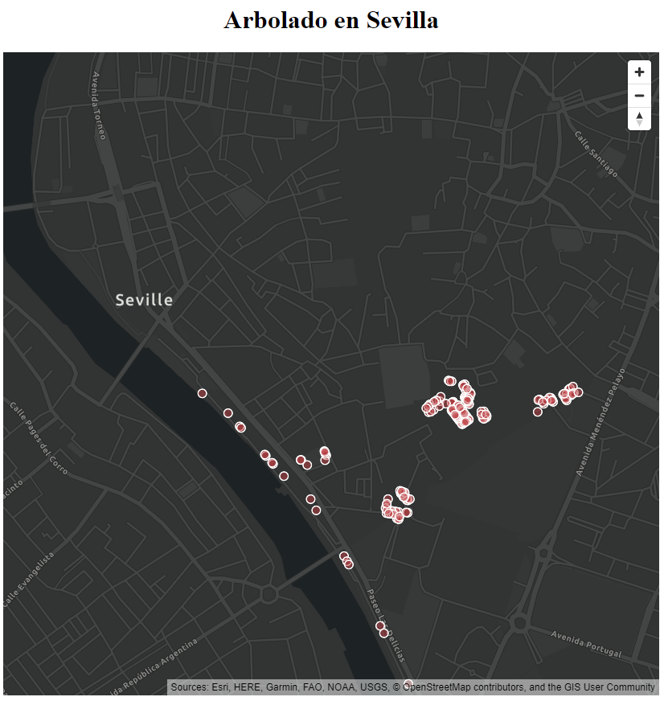

# Mapbox GL JS + ArcGIS



Este es un ejemplo de cómo integrar [Mapbox GL JS](https://docs.mapbox.com/mapbox-gl-js/api/) y la [API de JavaScript de ArcGIS](https://developers.arcgis.com/mapbox-gl-js/). Para esta integración tan solo necesitamos cargar la librería de Mapbox. En este caso lo hemos cargado desde el CDN:

```html
  <script src="https://api.tiles.mapbox.com/mapbox-gl-js/v1.12.0/mapbox-gl.js"></script>
  <link href="https://api.tiles.mapbox.com/mapbox-gl-js/v1.12.0/mapbox-gl.css" rel="stylesheet" />
```

Sin embargo, aunque no necesitemos la API de ArcGIS, si que tenemos que utilizar la API key de ArcGIS Platform.

> **Nota:** Es necesario que estés registrado en https://developers.arcgis.com/ para generarla.


## Pasos
### 1. Creación del mapa.
Vamos a generar un mapa de Mapbox pero utilizando los mapas base de Esri.
```js
const apiKeyEsri = 'your-api-key';

const basemapStyle = 'ArcGIS:DarkGray';

const map = new mapboxgl.Map({
  container: "map",
  style: `https://basemaps-api.arcgis.com/arcgis/rest/services/styles/${basemapStyle}?type=style&token=${apiKeyEsri}`,
  center: [-6.001902, 37.392535],
  zoom: 13
});
```
A *Map* le pasaremos la URL del mapa base donde indicaremos el estilo del mapa y nuestra API key. En este caso hemos optado por *ArcGIS:DarkGray* pero hay [muchas opciones](https://developers.arcgis.com/documentation/mapping-apis-and-services/maps/services/basemap-layer-service/#basemap-styles).


### 2. Cargar datos.
En este caso vamos a cargar datos del [portal de datos abiertos de Esri](https://hub.arcgis.com/datasets/ideSEVILLA::parques-y-jardines-arbol-viario?geometry=-6.282%2C37.326%2C-5.628%2C37.422). Concretamente, los datos sobre el arbolado de Sevilla. Toda esta carga y renderizado de datos la podemos encapsular en una función, en este caso la llamaremos *showTrees*.
* Cargamos la URL del servicio haciendo la petición de los datos que deseamos pasando los parámetros por la URL.
```js
function showTrees() {
  const treesURL = "https://services1.arcgis.com/hcmP7kr0Cx3AcTJk/arcgis/rest/services/Parques_y_Jardines_Arbol_ZonaVerde/FeatureServer/0/query?where=1=1&outFields=*&f=pgeojson";
}
```
* Añadimos ese Feature Server como fuente de datos y el formato de los datos.
```js
map.addSource("points", {
  type: "geojson",
  data: treesURL
});
```
* Añadimos la capa al mapa indicando la simbología.
```js
map.addLayer({
  id: "trailheads-circle",
  type: "circle",
  source: "points"
});
```
* Podemos personalizar la simbología cuando añadimos la capa. En este caso hemos optado por círculos rojos con un borde blanco.
```js
  map.addLayer({
    id: "trailheads-circle",
    type: "circle",
    source: "points",
    paint: {
      "circle-color": "rgba(193, 66, 66, 0.5)",
      "circle-stroke-width": 1.5,
      "circle-stroke-color": "white",
    }
  });
```
>El resultado hasta ahora es el siguiente: 


### 3. Simbología en función del valor
A pesar de haber personalizado un poco la simbología, vamos a hacer un renderizado en función del estado del árbol. Para ello vamos a sustituir el fragmento de código anterior por el siguiente:
```js
map.addLayer({
    id: "trees",
    type: "circle",
    source: "points",
    paint: {
      "circle-color": [
        "match",
        ["get", "Observ"],
        "Joven", "#228B22",
        "Maduro", "#006400",
        "Recién plantado", "#ADFF2F",
        "Viejo", "#808000",
        "Decrépito", "#556B2F",
        "No consolidado", "#00FF00",
        "black" // default color
      ]
    }
  });
```
El estado de los árboles viene definido por el campo *Observ* y en función del valor que tome ese campo, se le aplicará un color distinto. 

### 4. Renderizado sobre el mapa.
El renderizado de la capa se realizará una vez se haya cargado el mapa.
```js
map.on('load', () => {
  showTrees();
});
```

### 5. Creación de la leyenda.
* Para crear la leyenda necesitamos dos variables, un array con los colores y otro con los diferentes estados del arbolado.
```js
const labels = ['Joven', 'Maduro', 'Recién plantado', 'Viejo', 'Decrépito', 'No consolidado', 'Sin datos'];
const colors = ["#228B22", "#006400", "#ADFF2F", "#808000", "#556B2F", "#00FF00", "#000"];
```
* Con un bucle recorreremos ambos arrays e iremos añadiendo cada elemento al DOM.
```js
for (i = 0; i < labels.length; i++) {
  const layer = labels[i];
  const color = colors[i];
  const item = document.createElement('div');
  item.style.display = 'flex';
  item.style.alignItems = 'center';

  const key = document.createElement('p');
  key.className = 'legend-key';
  key.style.backgroundColor = color;

  let value = document.createElement('span');
  value.innerHTML = layer;
  value.style.marginLeft = '3px'
  item.appendChild(key);
  item.appendChild(value);
  legend.appendChild(item);
}
```
* Toda esta lógica estará encapsulada en una función que, como antes, ejecutaremos cuando se haya cargado el mapa.
```js
map.on("load", () => {  
  showTrees();
  createLegend();
});
```

### 6. Mejora de la navegación
Para mejorar la experiencia de usuario añadiremos controles de navegación al mapa.
```js
map.addControl(new mapboxgl.NavigationControl());
```