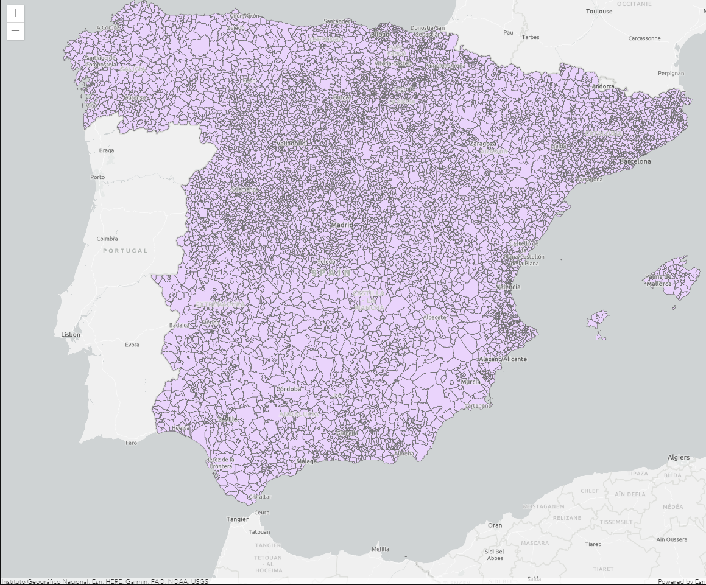

# Crear una rampa color


A partir de una [feature layer sobre la España despoblada](https://www.arcgis.com/home/item.html?id=0beaf63767ee47fdb272dc76aeb3ac5b) disponible en el [Living Atlas ](https://livingatlas.arcgis.com/) hemos creado esta visualización con el número de habitantes por hectárea.

## Pasos
1. Creación del mapa y su vista.
```js
const map = new Map({
  basemap: "gray-vector"
});

const view = new MapView({
  map: map,
  container: "viewDiv",
  center: [-3.690468, 40.402254],
  zoom: 6
});
```

2. Creamos la capa y la añadimos al mapa.

```js
const populationLayer = new FeatureLayer({
  url: "https://services1.arcgis.com/nCKYwcSONQTkPA4K/ArcGIS/rest/services/La_Espa%c3%b1a_despoblada/FeatureServer/0",
});

map.add(populationLayer);
```

Como aún no hemos definido qué campo vamos a representar nos aparecerá uno por defecto, en este caso, los límites municipales.



3. Una vez elegido el [campo del servicio](https://services1.arcgis.com/nCKYwcSONQTkPA4K/ArcGIS/rest/services/La_Espa%c3%b1a_despoblada/FeatureServer/0) que queremos representar, definiremos la simbología del renderizado.

Crearemos un símbolo por defecto que se usará en caso de que falte algún dato:
```js
const defaultSym = {
  type: "simple-fill", // autocasts as new SimpleFillSymbol()
  outline: { // autocasts as new SimpleLineSymbol()
    color: [128, 128, 128, 0.2],
    width: "0.5px"
  }
};
```

Definimos la rampa de color y el campo sobre el que la aplicaremos indicando el valor máximo y mínimo y los colores de cada uno. De esta forma, los valores intermedios tendrán un color proporcional a su valor:

```js
const populationRenderer = {
  type: "simple", // autocasts as new SimpleRenderer()
  symbol: defaultSym,
  visualVariables: [
    {
      type: "color",
      field: "HabHa", // Campo elegido
      stops: [
        {
          value: 0.5,
          color: "#b5e5e1",
          label: "<0.5"
        },
        {
          value: 5,
          color: "#143936",
          label: "> 5"
        }
      ]
    }
  ]
};
```
Aplicamos el renderizado a la capa:
```js
const populationLayer = new FeatureLayer({
  url: "https://services1.arcgis.com/nCKYwcSONQTkPA4K/ArcGIS/rest/services/La_Espa%c3%b1a_despoblada/FeatureServer/0",
  renderer: populationRenderer
});
```

### 💡 Pro Tip!
Podemos añadir una leyenda para facilitar la interpretación del mapa. Para ello tan solo hay que cargar el módulo de [leyenda](https://developers.arcgis.com/javascript/latest/api-reference/esri-widgets-Legend.html#):
```js
import Legend from "https://js.arcgis.com/4.18/@arcgis/core/widgets/Legend.js";
```
Y añadirlo al mapa con el título que elijamos:
```js
view.ui.add(
  new Legend({
    view: view,
    layerInfos: [{
      layer: populationLayer,
      title: "La España vaciada en 2018"
    }]
  }),
  "bottom-right"
);
```