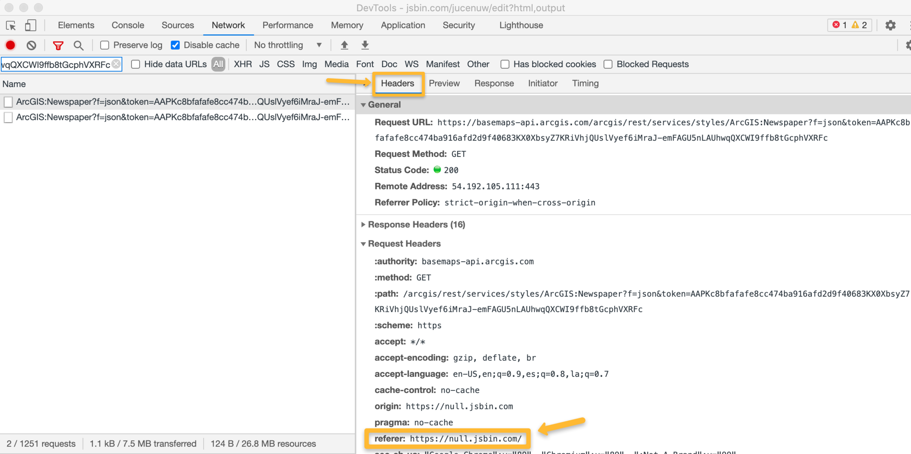
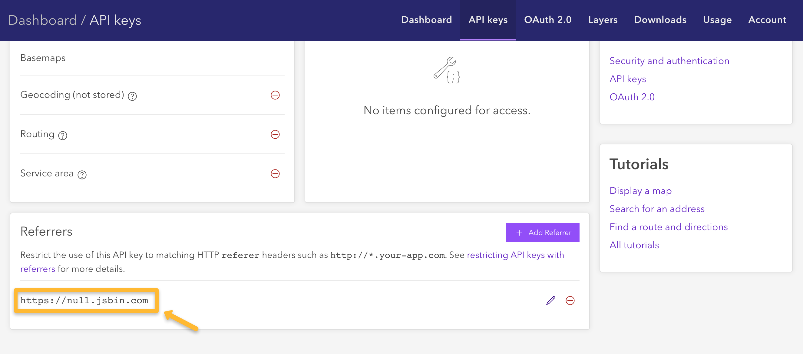

# Tipos de Mapa o "Mapas base"

A los conocidos estilos de mapa como: "Satélite", "Relieve", "Callejero", ... se les conoce por diferentes nombres. Por ejemplo: Google Maps los llama "tipos de mapa", OSM/Mapbox/... "Tiled map" (mapas de teselas), en ArcGIS **"Mapas base" (o basemaps)**.


> **Nota:** En ArcGIS cuando usamos el [término basemap](https://developers.arcgis.com/documentation/glossary/basemap/) normalmente nos referimos a un mapa de cobertura mundial y que sirve para dar contexto. Hay otro mapas teselados que se pueden usar por ejemplo para superponer imágenes sátelite sobre un mapa en un desastre natural (ej: [mapa de teselas de las crecidas del Ebro de 2015](https://tiles.arcgis.com/tiles/nCKYwcSONQTkPA4K/arcgis/rest/services/deimosZona1/MapServer?f=jsapi&cacheKey=b8476fe9b32f6ec6usamos))

A continuación te dejamos un snippet donde podrás probar algunos de [los basemaps](https://developers.arcgis.com/javascript/latest/api-reference/esri-Map.html#basemap) disponibles en ArcGIS.

> **Nota:** Recuerda que para poder hacer funcionar este script en otro dominio tendrás que tener una [cuenta gratuita de desarrollador](https://developers.arcgis.com/sign-up/) y cambiar la API Key:

```js
import MapView from "https://js.arcgis.com/4.18/@arcgis/core/views/MapView.js";
import Map from "https://js.arcgis.com/4.18/@arcgis/core/Map.js";
import esriConfig from "https://js.arcgis.com/4.18/@arcgis/core/config.js";

esriConfig.apiKey = "AAPKf68f70fbe48946a9ac34d40f1866ce27REhFORagxUZVr4zy0hXN1rsCmfRKfz-v_00vAK0Gc2Q2MXbPBeJHsRoh1Ik1nLS7";

const basemaps = ["arcgis-imagery", "arcgis-imagery-standard", "arcgis-imagery-labels", "arcgis-light-gray", "arcgis-dark-gray", "arcgis-navigation", "arcgis-navigation-night", "arcgis-streets", "arcgis-streets-night", "arcgis-streets-relief", "arcgis-topographic", "arcgis-oceans", "osm-standard", "osm-standard-relief", "osm-streets", "osm-streets-relief", "osm-light-gray", "osm-dark-gray", "arcgis-terrain", "arcgis-community", "arcgis-charted-territory", "arcgis-colored-pencil", "arcgis-nova", "arcgis-modern-antique", "arcgis-midcentury", "arcgis-newspaper", "arcgis-hillshade-light", "arcgis-hillshade-dark"];

const map = new Map({
  basemap: basemaps[0]
});

const view = new MapView({
  map: map,
  zoom: 13, // Zoom level
  container: "viewDiv" // Div element
});
```


Para restringir el uso de la API recomendamos introducir:
* El dominio y el protocolo
* Y no usar la ruta (path) ya que algunos navegadores lo eliminan por cuestiones de privacidad

Si al introducir la restricción te aparece un error en consola como el siguiente:


En este caso “Invalid token” hace referencia a que el “referrer” no está bien configurado, para saber qué “referrer” introducir filtra en la pestaña network/red e introduce un filtro usando la API Key:


Y en la pestaña “Headers” observa cuál es el “referrer” que está enviando el navegador:



A continuación introduce el mismo “referrer” en las configuraciones de la API Key:



Puede que tarde unos segundos en funcionar, pero en no más de 30 segundos este debería funcionar.
