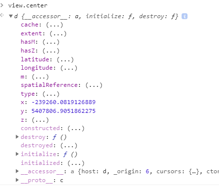
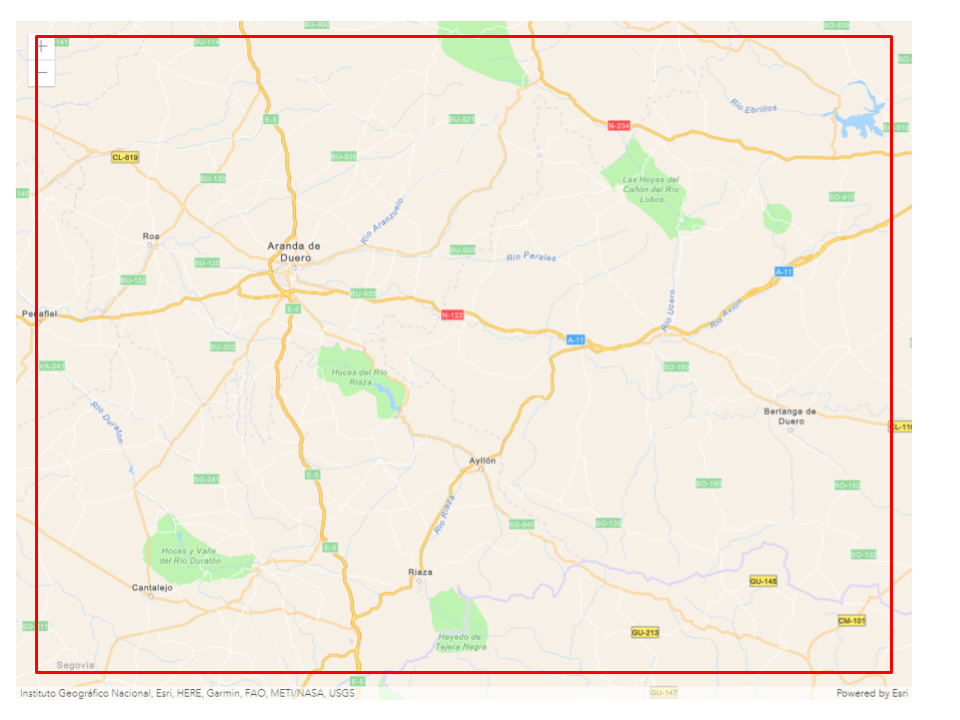

# HelloWord! con la API de JavaScript de ArcGIS

Antes de empezar a trabajar con la API de JavaScritp tendremos que crearnos una cuenta gratuita de [developer](https://developers.arcgis.com/sign-up/) para aceptar los términos de uso. Este tipo de [cuenta gratuita](https://esri-es.github.io/licenciamiento-developers/#/desarrollo/README?id=arcgis-developer-plans-adp) incluye las licencias para usar SDKs, APIs, generación de aplicaciones... en entornos de desarrollo y pruebas sin ningún coste y por tiempo ilimitado.

Una vez creada, ya podemos empezar a trabajar en local sobre nuestra aplicación. 

En el ```head``` de nuestro archivo html añadiremos los estilos e importamos la librería de ArcGIS. 

```
  <link rel="stylesheet" href="https://js.arcgis.com/4.17/esri/themes/light/main.css">
  <script src="https://js.arcgis.com/4.17/"></script>
  <script src="index.js" type="text/javascript"></script>

  <link  type="text/css" href="style.css" rel="stylesheet" />
```

En este caso hemos añadido el tema Ligth, aquí puedes ver [más estilos](https://developers.arcgis.com/javascript/latest/guide/styling/). Además, si queremos trabajar con archivos JavaScript y CSS, será ahí donde los añadiremos. (???)

Vamos a aplicar estos estilos para que el mapa ocupe casi toda la pantalla.
style.css
```
html, body, #wrapper-map { 
  padding: 0; 
  margin: 0; 
  height: 85vh; 
  width: 100%; 
}
```

En el script de JavaScript utilizaremos un ```require``` que recibe dos parámetros, un array con las clases que vamos a utilizar y una función a modo de "callback" que recibirá todas las clases en los argumentos. Por ahora, vamos a incluir todas las que necesitamos para el ejemplo y las iremos explicando según las vayamos usando. 

Una vez incluidas nuestro script quedará así:

```
require([ 
  "esri/Map",  
  "esri/views/MapView", 
  "esri/layers/GraphicsLayer",  
  "esri/Graphic"],  
  function ( 
    Map,  
    MapView,  
    GraphicsLayer,  
    Graphic) { 
      
    });
```

## ¿Por dónde empezamos?

Comenzaremos añadiendo un mapa en 2D. Dentro de la función que acabamos de crear añadiremos la clase [Map](https://developers.arcgis.com/javascript/latest/api-reference/esri-Map.html) seleccionando un mapa de fondo de todos los que tenemos disponibles en ArcGIS. En este caso hemos elegido un mapa de las calles pero prueba con otros estilos como "dark-gray-vector", "streets", "satellite", "hybrid", "terrain", "topo", "gray", "oceans", "national-geographic", "osm", "streets-night-vector"...

```
const map = new Map ({
  basemap: "streets-navigation-vector"
});
```

Ahora este mapa lo añadiremos a la vista para visualizarlo en el navegador para lo que utilizaremos la clase [MapView](https://developers.arcgis.com/javascript/latest/api-reference/esri-views-MapView.html). Para instanciar esta clase es obligatorio especificar el ID del elemento HTML donde se va a cargar.

```
const view = new MapView ({
  container: "wrapper-map",
  map,
  center: [-3.690504, 41.670161], 
  zoom: 11
});
```

De esta forma, ya tenemos un mapa centrado y con un zoom.

***

### Quick Tip!

Si declaramos la variable ```view``` de forma global podremos acceder al punto central del mapa. Para ello, en la consola tendremos que acceder a ```view.center``` y veremos las coordenadas x e y.


***

***

### Pro Tip!

Otra forma de centrar el mapa es con la extensión que determina el cuadro de visión del mapa y se establece definiendo los vértices del cuadro. Podems acceder y definirla desde ```view.extent```.


***

## Pintar un punto en el mapa

Ahora que ya tenemos el mapa vamos a pintar un punto. Como tan solo es uno, vamos a hacerlo a mano, diciendo las coordenadas X e Y del punto. 

En ArcGIS se trabaja superponiendo capas, de la misma forma que se trabaja con un programa de edición de fotos como Photoshop o usar papel [cebolla](https://www.youtube.com/watch?v=x48dnIRlHwk&ab_channel=CrystalWagner). Hay diferentes tipos de capas y, en este caso, vamos utilizar una capa gráfica que nos permite dibujar libremente lo que queramos.

Primero crearemos la capa de gráficos con la clase [GraphicsLayer](https://developers.arcgis.com/javascript/latest/api-reference/esri-layers-GraphicsLayer.html) y la añadimos al mapa.

```
const graphicsLayer = new GraphicsLayer();
map.add(graphicsLayer);
```

Ahora declararemos el punto dándole las coordenadas de longitud y latitud. Este punto lo vamos a declarar utilizando la clase [geometry](https://developers.arcgis.com/javascript/latest/api-reference/esri-geometry.html) que no vamos a usar explícitamente sino un objeto con las propiedades que la clase [Graphic](https://developers.arcgis.com/javascript/latest/api-reference/esri-Graphic.html) parseará e instanciará, a este proceso le llamamos [Autocasting](https://developers.arcgis.com/javascript/latest/guide/programming-patterns/#autocasting).


```
const point = {
  type: 'point',
  longitude: -3.688167, 
  latitude: 41.671088 
};
```

Vamos a definir cómo se va a pintar el punto. En este caso, va a ser un símbolo sencillo pero hay muchos más tipos de símbolo como los siguientes, [aquí](https://developers.arcgis.com/javascript/3/samples/playground/index.html) puedes probarlos.


```
const simpleMarkerSymbol = { 
  type: "simple-marker", 
  color: [226, 119, 40], 
  outline: { 
    color: [255, 255, 255], 
    width: 1 
  } 
}; 
```

Una vez que tenemos todo definido vamos a combinarlo, en la clase [Graphic](https://developers.arcgis.com/javascript/latest/api-reference/esri-Graphic.html) asignaremos la ubicación y la simbología.

```
const pointGraphic = new Graphic ({
  geometry: point,
  symbol: simpleMarkerSymbol
});
```

Por último, añadiremos el punto a la capa de gráficos que creamos y añadimos al mapa.

```
graphicsLayer.add(pointGraphic);
```